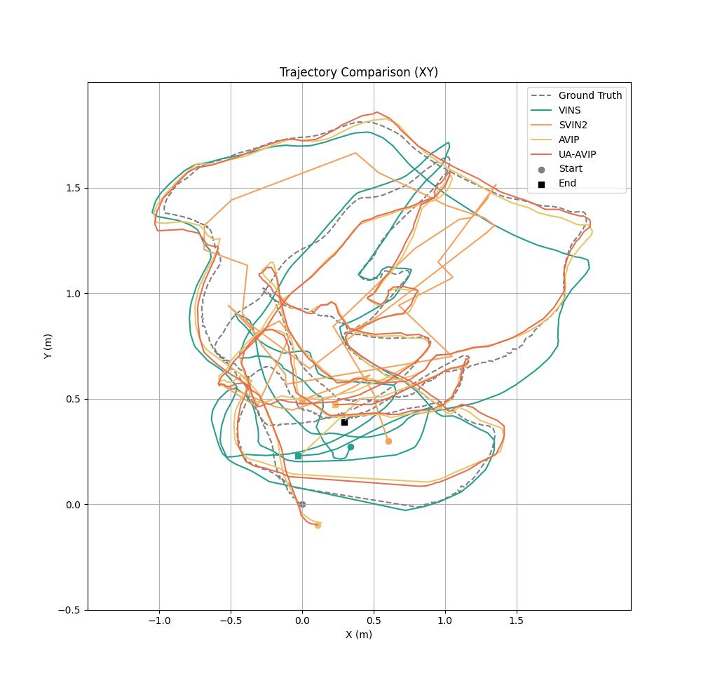
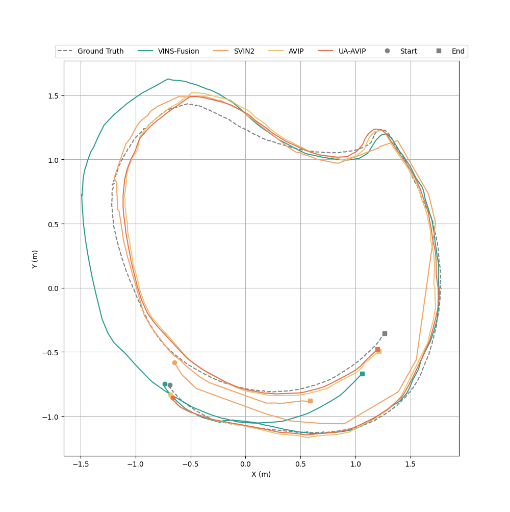
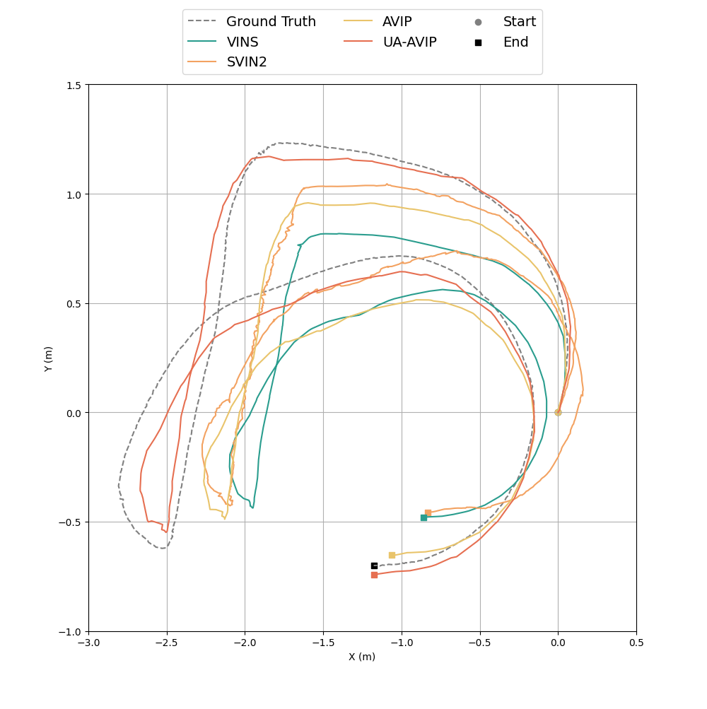

# UA-AVIP
UA-AVIP: Multi-Modal Fusion for Underwater Localization through Hierarchical Uncertainty Awareness

## Demo 
### Demo on Pool sequences (Speed *5)

Eg 1

 

Eg 2

Underwater Scene of
Pool 01

Underwater Scene of
Pool 02 & 03

## Performance Evaluation and Comparison
### Pool 01

### Pool 02

### Pool 03

